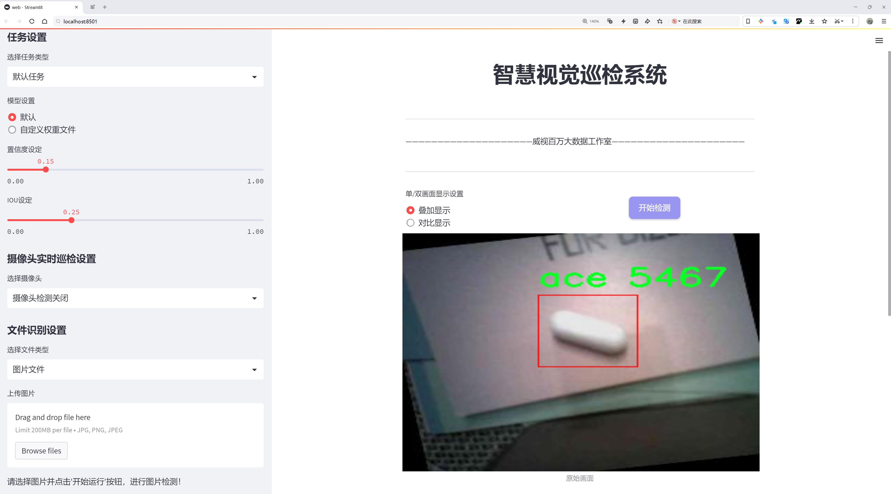
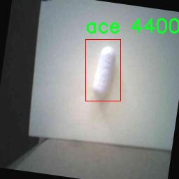

# 药品识别与分类检测系统源码分享
 # [一条龙教学YOLOV8标注好的数据集一键训练_70+全套改进创新点发刊_Web前端展示]

### 1.研究背景与意义

项目参考[AAAI Association for the Advancement of Artificial Intelligence](https://gitee.com/qunmasj/projects)

项目来源[AACV Association for the Advancement of Computer Vision](https://kdocs.cn/l/cszuIiCKVNis)

研究背景与意义

随着全球人口老龄化和慢性疾病的增加，药品的使用频率不断上升，药品的种类和数量也日益繁多。在这样的背景下，药品的识别与分类显得尤为重要。传统的药品识别方法主要依赖于人工检查和专业知识，这不仅耗时耗力，而且容易出现错误。为了解决这一问题，基于计算机视觉和深度学习技术的自动化药品识别与分类系统应运而生。近年来，YOLO（You Only Look Once）系列模型因其高效的实时目标检测能力而受到广泛关注，尤其是YOLOv8模型在精度和速度上的进一步提升，为药品识别提供了新的可能性。

本研究旨在基于改进的YOLOv8模型，构建一个高效的药品识别与分类系统。我们所使用的数据集“8-pill”包含824张图像，涵盖9个类别，包括C、LIP、Pills、VINEGAR、ace、air、centrum、iron和mag等。这些类别不仅包括常见的药品，还涵盖了一些可能被误认为药品的物品，如醋（VINEGAR）等。这种多样性使得模型在实际应用中能够更好地应对复杂的药品环境，提高识别的准确性和鲁棒性。

药品识别与分类系统的研究意义主要体现在以下几个方面。首先，从医疗安全的角度来看，准确的药品识别能够有效减少用药错误，保障患者的用药安全。通过自动化的识别系统，医务人员可以快速确认药品信息，避免因人工操作带来的失误。其次，从药品管理的角度，自动化的药品分类系统能够提高药品库存管理的效率，减少人力成本，提升药品流通的透明度和可追溯性。此外，随着智能手机和移动设备的普及，基于深度学习的药品识别系统可以嵌入到移动应用中，方便用户在日常生活中快速识别药品，提升公众的用药知识和安全意识。

在技术层面，改进YOLOv8模型的应用将推动目标检测技术在药品识别领域的深入发展。通过对模型结构的优化和训练策略的改进，我们期望在保证检测精度的同时，提升模型的实时性和适应性。这不仅有助于药品识别系统的实际应用，也为其他领域的目标检测提供了借鉴。

综上所述，基于改进YOLOv8的药品识别与分类系统的研究具有重要的理论价值和实际意义。它不仅能够提升药品识别的准确性和效率，保障用药安全，还能推动相关技术的发展，促进医疗行业的智能化进程。随着研究的深入，我们期待这一系统能够在实际应用中发挥更大的作用，为人们的健康生活提供有力支持。

### 2.图片演示




##### 注意：由于此博客编辑较早，上面“2.图片演示”和“3.视频演示”展示的系统图片或者视频可能为老版本，新版本在老版本的基础上升级如下：（实际效果以升级的新版本为准）

  （1）适配了YOLOV8的“目标检测”模型和“实例分割”模型，通过加载相应的权重（.pt）文件即可自适应加载模型。

  （2）支持“图片识别”、“视频识别”、“摄像头实时识别”三种识别模式。

  （3）支持“图片识别”、“视频识别”、“摄像头实时识别”三种识别结果保存导出，解决手动导出（容易卡顿出现爆内存）存在的问题，识别完自动保存结果并导出到tempDir中。

  （4）支持Web前端系统中的标题、背景图等自定义修改，后面提供修改教程。

  另外本项目提供训练的数据集和训练教程,暂不提供权重文件（best.pt）,需要您按照教程进行训练后实现图片演示和Web前端界面演示的效果。

### 3.视频演示

[3.1 视频演示](https://www.bilibili.com/video/BV1KkxeeYEvp/)

### 4.数据集信息展示

##### 4.1 本项目数据集详细数据（类别数＆类别名）

nc: 8
names: ['C', 'LIP', 'VINEGAR', 'ace', 'air', 'centrum', 'iron', 'mag']


##### 4.2 本项目数据集信息介绍

数据集信息展示

在药品识别与分类的研究领域，数据集的质量和多样性直接影响到模型的训练效果和最终的应用性能。本研究采用的“8-pill”数据集，专门为改进YOLOv8模型在药品识别与分类任务中的表现而设计。该数据集包含了8个不同的类别，涵盖了多种常见药品和补充剂，旨在为模型提供丰富的训练样本，以提高其识别准确率和分类能力。

“8-pill”数据集的类别包括：C、LIP、VINEGAR、ace、air、centrum、iron和mag。这些类别代表了不同类型的药品和营养补充剂，分别对应于不同的功能和用途。例如，C类可能代表某种特定的药物，而LIP则可能是指某种与脂肪相关的补充剂。VINEGAR则可能涉及到以醋为基础的健康产品，ace可能是指一种维生素或矿物质补充剂，air可能与呼吸系统相关的药物有关，centrum是一个知名的综合维生素品牌，iron则显然与铁元素补充剂相关，最后，mag可能是指镁补充剂。

该数据集的设计考虑到了药品的多样性和实际应用场景中的复杂性，确保模型在面对不同药品时能够有效地进行识别和分类。每个类别的样本均经过精心挑选，确保数据的代表性和多样性，从而增强模型的泛化能力。通过使用“8-pill”数据集，研究人员能够训练出更为精准的YOLOv8模型，使其在实际应用中能够快速、准确地识别和分类药品，满足医疗和健康管理的需求。

此外，数据集中的样本不仅涵盖了药品的外观特征，还考虑到了不同环境下的拍摄条件，如光照、角度和背景等。这种多样化的样本设置，使得模型在训练过程中能够学习到更为丰富的特征，从而提高其在真实世界应用中的鲁棒性。例如，药品在不同的光照条件下可能呈现出不同的颜色和阴影，而这些变化可能会影响模型的识别效果。因此，数据集中的样本经过了多种环境条件的模拟，确保模型能够适应各种实际场景。

总之，“8-pill”数据集为改进YOLOv8的药品识别与分类系统提供了坚实的基础。通过对多样化药品类别的深入挖掘和丰富样本的提供，研究人员能够有效地训练出高性能的模型，以应对日益增长的药品识别需求。这不仅有助于提高药品管理的效率，也为患者提供了更为安全和便捷的用药体验。随着技术的不断进步和数据集的不断完善，未来的药品识别与分类系统将更加智能化，能够在更广泛的应用场景中发挥重要作用。




### 5.全套项目环境部署视频教程（零基础手把手教学）

[5.1 环境部署教程链接（零基础手把手教学）](https://www.ixigua.com/7404473917358506534?logTag=c807d0cbc21c0ef59de5)


[5.2 安装Python虚拟环境创建和依赖库安装视频教程链接（零基础手把手教学）](https://www.ixigua.com/7404474678003106304?logTag=1f1041108cd1f708b01a)

### 6.手把手YOLOV8训练视频教程（零基础小白有手就能学会）

[6.1 手把手YOLOV8训练视频教程（零基础小白有手就能学会）](https://www.ixigua.com/7404477157818401292?logTag=d31a2dfd1983c9668658)

### 7.70+种全套YOLOV8创新点代码加载调参视频教程（一键加载写好的改进模型的配置文件）

[7.1 70+种全套YOLOV8创新点代码加载调参视频教程（一键加载写好的改进模型的配置文件）](https://www.ixigua.com/7404478314661806627?logTag=29066f8288e3f4eea3a4)

### 8.70+种全套YOLOV8创新点原理讲解（非科班也可以轻松写刊发刊，V10版本正在科研待更新）

由于篇幅限制，每个创新点的具体原理讲解就不一一展开，具体见下列网址中的创新点对应子项目的技术原理博客网址【Blog】：


[8.1 70+种全套YOLOV8创新点原理讲解链接](https://gitee.com/qunmasj/good)

### 9.系统功能展示（检测对象为举例，实际内容以本项目数据集为准）

图9.1.系统支持检测结果表格显示

  图9.2.系统支持置信度和IOU阈值手动调节

  图9.3.系统支持自定义加载权重文件best.pt(需要你通过步骤5中训练获得)

  图9.4.系统支持摄像头实时识别

  图9.5.系统支持图片识别

  图9.6.系统支持视频识别

  图9.7.系统支持识别结果文件自动保存

  图9.8.系统支持Excel导出检测结果数据


### 10.原始YOLOV8算法原理

原始YOLOv8算法原理

YOLOv8是Ultralytics于2023年1月发布的一款创新型目标检测模型，标志着YOLO系列算法的又一次重要进化。它的设计理念是将前几代YOLO算法的优点进行整合，尤其是吸收了YOLOX、YOLOv6、YOLOv7和PPYOLOE等算法的精华，特别是在头部标签分配和损失函数的设计上，YOLOv8与PP-YOLOE有着显著的相似性。这种集成化的设计使得YOLOv8在实时检测领域达到了一个新的高度，展现出更高的精度和更快的速度，极大地推动了目标检测技术的发展。

YOLOv8的核心架构由三个主要部分组成：主干网络（backbone）、特征增强网络（neck）和检测头（head）。在主干网络方面，YOLOv8继续采用了CSP（Cross Stage Partial）结构，这种结构通过分割和重组特征图，能够有效减少计算量并提高特征提取的效率。CSP的引入不仅增强了模型的表达能力，还使得网络在处理复杂场景时能够保持较高的性能。

特征增强网络部分，YOLOv8采用了PAN-FPN（Path Aggregation Network - Feature Pyramid Network）的设计理念。PAN-FPN通过不同层次的特征融合，能够更好地捕捉到多尺度目标的信息，从而提升模型对不同大小目标的检测能力。这种特征增强策略使得YOLOv8在面对复杂背景和多样化目标时，依然能够保持较高的检测精度。

在检测头的设计上，YOLOv8引入了解耦头的概念，取代了以往的耦合头结构。传统的目标检测模型通常将分类和回归任务耦合在一起，导致在复杂场景下可能出现定位不准确和分类错误的问题。而YOLOv8通过将这两个任务解耦为独立的分支，使得每个任务能够更加专注于自身的目标，从而有效提升了检测的准确性和鲁棒性。这种解耦设计不仅优化了模型的性能，还使得YOLOv8在训练和推理时更加高效。

YOLOv8还采用了Anchor-free目标检测方法，这是一种基于回归的检测策略。传统的目标检测方法依赖于预定义的锚点框来预测目标的位置和大小，这种方法在处理不同尺度和形状的目标时往往显得繁琐且不够灵活。而YOLOv8的Anchor-free方法则直接预测目标的边界框，省去了锚点框选择和调整的复杂过程。这种设计使得网络能够更快地聚焦于目标位置的邻近点，从而使得预测框更接近于实际的边界框区域，提升了检测的精度和速度。

此外，YOLOv8在损失函数的设计上也进行了创新，结合了多种损失函数的优点，以提高模型的训练效果。通过精细化的损失计算，YOLOv8能够更好地优化模型参数，使得在训练过程中能够更快地收敛，并在测试时展现出更高的准确性。

YOLOv8的轻量化设计使得其权重文件相较于之前的YOLO系列有了显著的减小，这使得它能够在各种嵌入式设备上进行部署，满足实时检测的需求。无论是在移动设备、无人机还是自动驾驶系统中，YOLOv8都能以其高效的性能提供实时的目标检测服务。

综上所述，YOLOv8作为YOLO系列的最新版本，凭借其高效的网络结构、创新的解耦设计和灵活的Anchor-free检测方法，在目标检测领域展现出了卓越的性能。它不仅提高了检测的精度和速度，还为各种应用场景提供了更为强大的支持。随着YOLOv8的广泛应用，目标检测技术必将迎来新的发展机遇，为各行各业带来更为深远的影响。


### 11.项目核心源码讲解（再也不用担心看不懂代码逻辑）

#### 11.1 70+种YOLOv8算法改进源码大全和调试加载训练教程（非必要）\ultralytics\models\fastsam\utils.py

以下是对代码的核心部分进行保留和详细注释的版本：

```python
import torch

def adjust_bboxes_to_image_border(boxes, image_shape, threshold=20):
    """
    调整边界框，使其在接近图像边界时粘附于图像边缘。

    参数:
        boxes (torch.Tensor): 边界框坐标，形状为 (n, 4)，每个框由 (x1, y1, x2, y2) 表示
        image_shape (tuple): 图像的高度和宽度，形状为 (height, width)
        threshold (int): 像素阈值，表示距离边界的最小距离

    返回:
        adjusted_boxes (torch.Tensor): 调整后的边界框
    """
    h, w = image_shape  # 获取图像的高度和宽度

    # 调整边界框的位置
    boxes[boxes[:, 0] < threshold, 0] = 0  # 如果 x1 小于阈值，则设置为 0
    boxes[boxes[:, 1] < threshold, 1] = 0  # 如果 y1 小于阈值，则设置为 0
    boxes[boxes[:, 2] > w - threshold, 2] = w  # 如果 x2 超过图像宽度减去阈值，则设置为图像宽度
    boxes[boxes[:, 3] > h - threshold, 3] = h  # 如果 y2 超过图像高度减去阈值，则设置为图像高度
    
    return boxes  # 返回调整后的边界框

def bbox_iou(box1, boxes, iou_thres=0.9, image_shape=(640, 640), raw_output=False):
    """
    计算一个边界框与其他边界框的交并比 (IoU)。

    参数:
        box1 (torch.Tensor): 单个边界框，形状为 (4, )
        boxes (torch.Tensor): 一组边界框，形状为 (n, 4)
        iou_thres (float): IoU 阈值，用于筛选高重叠的边界框
        image_shape (tuple): 图像的高度和宽度，形状为 (height, width)
        raw_output (bool): 如果为 True，则返回原始 IoU 值，而不是索引

    返回:
        high_iou_indices (torch.Tensor): 与 box1 的 IoU 大于阈值的边界框索引
    """
    boxes = adjust_bboxes_to_image_border(boxes, image_shape)  # 调整边界框以适应图像边界

    # 计算交集的坐标
    x1 = torch.max(box1[0], boxes[:, 0])  # 交集左上角 x 坐标
    y1 = torch.max(box1[1], boxes[:, 1])  # 交集左上角 y 坐标
    x2 = torch.min(box1[2], boxes[:, 2])  # 交集右下角 x 坐标
    y2 = torch.min(box1[3], boxes[:, 3])  # 交集右下角 y 坐标

    # 计算交集面积
    intersection = (x2 - x1).clamp(0) * (y2 - y1).clamp(0)  # clamp(0) 确保面积为非负

    # 计算每个框的面积
    box1_area = (box1[2] - box1[0]) * (box1[3] - box1[1])  # box1 的面积
    box2_area = (boxes[:, 2] - boxes[:, 0]) * (boxes[:, 3] - boxes[:, 1])  # boxes 的面积

    # 计算并集面积
    union = box1_area + box2_area - intersection  # 并集面积 = A + B - 交集

    # 计算 IoU
    iou = intersection / union  # IoU 值，形状为 (n, )
    
    if raw_output:
        return 0 if iou.numel() == 0 else iou  # 如果需要原始 IoU 值，则返回

    # 返回 IoU 大于阈值的边界框索引
    return torch.nonzero(iou > iou_thres).flatten()
```

### 代码分析
1. **`adjust_bboxes_to_image_border` 函数**:
   - 该函数的目的是确保边界框在接近图像边界时被调整到图像的边缘。
   - 通过比较边界框的坐标与阈值，调整其位置。

2. **`bbox_iou` 函数**:
   - 该函数计算一个边界框与其他边界框之间的交并比 (IoU)，用于评估它们的重叠程度。
   - 首先调用 `adjust_bboxes_to_image_border` 函数来确保所有边界框都在图像内。
   - 然后计算交集、各自的面积以及并集面积，最后计算 IoU。
   - 根据 `raw_output` 参数，返回原始 IoU 值或符合条件的边界框索引。

这个文件是一个用于YOLO（You Only Look Once）目标检测算法的工具模块，主要包含两个函数，分别用于调整边界框和计算交并比（IoU）。

首先，`adjust_bboxes_to_image_border`函数的作用是调整给定的边界框，使其不超出图像的边界。如果边界框的某一边距离图像边界小于指定的阈值（默认为20个像素），则将该边界框的坐标调整到图像的边界上。该函数接受三个参数：`boxes`是一个形状为(n, 4)的张量，表示n个边界框的坐标；`image_shape`是一个元组，表示图像的高度和宽度；`threshold`是一个整数，表示调整的阈值。函数内部首先获取图像的高度和宽度，然后根据阈值调整边界框的坐标，最后返回调整后的边界框。

接下来的`bbox_iou`函数用于计算一个边界框与一组其他边界框之间的交并比。该函数接受多个参数，其中`box1`是一个形状为(4,)的张量，表示待计算的边界框；`boxes`是一个形状为(n, 4)的张量，表示其他边界框；`iou_thres`是一个浮点数，表示IoU的阈值；`image_shape`同样是图像的高度和宽度；`raw_output`是一个布尔值，指示是否返回原始的IoU值。函数首先调用`adjust_bboxes_to_image_border`来确保所有边界框都在图像范围内。接着，计算两个边界框的交集坐标，并计算交集的面积。然后，计算两个边界框的面积，并根据交集面积计算并集面积。最后，计算IoU值并根据阈值返回符合条件的边界框索引，或者在`raw_output`为True时返回原始的IoU值。

总的来说，这个文件提供了处理边界框的基本工具，确保边界框在图像内，并计算边界框之间的重叠程度，为YOLO目标检测算法的实现提供了必要的支持。

#### 11.2 ui.py

以下是经过简化并添加详细中文注释的核心代码部分：

```python
import sys
import subprocess

def run_script(script_path):
    """
    使用当前 Python 环境运行指定的脚本。

    Args:
        script_path (str): 要运行的脚本路径

    Returns:
        None
    """
    # 获取当前 Python 解释器的路径
    python_path = sys.executable

    # 构建运行命令，使用 streamlit 运行指定的脚本
    command = f'"{python_path}" -m streamlit run "{script_path}"'

    # 执行命令并等待其完成
    result = subprocess.run(command, shell=True)
    
    # 检查命令执行的返回码，如果不为0则表示出错
    if result.returncode != 0:
        print("脚本运行出错。")

# 主程序入口
if __name__ == "__main__":
    # 指定要运行的脚本路径
    script_path = "web.py"  # 假设脚本在当前目录下

    # 调用函数运行脚本
    run_script(script_path)
```

### 代码说明：
1. **导入模块**：
   - `sys`：用于获取当前 Python 解释器的路径。
   - `subprocess`：用于执行外部命令。

2. **`run_script` 函数**：
   - 接受一个参数 `script_path`，表示要运行的脚本的路径。
   - 使用 `sys.executable` 获取当前 Python 解释器的路径。
   - 构建一个命令字符串，使用 `streamlit` 模块运行指定的脚本。
   - 使用 `subprocess.run` 执行命令，并等待其完成。
   - 检查返回码，如果返回码不为0，表示脚本运行出错，打印错误信息。

3. **主程序入口**：
   - 使用 `if __name__ == "__main__":` 确保只有在直接运行该脚本时才会执行以下代码。
   - 指定要运行的脚本路径为 `web.py`。
   - 调用 `run_script` 函数来执行该脚本。

这个程序文件的主要功能是使用当前的 Python 环境来运行一个指定的脚本，具体来说是运行一个名为 `web.py` 的脚本。文件首先导入了必要的模块，包括 `sys`、`os` 和 `subprocess`，以及一个自定义的路径处理模块 `abs_path`。

在 `run_script` 函数中，首先获取当前 Python 解释器的路径，这样可以确保在正确的环境中运行脚本。接着，构建一个命令字符串，该命令使用 `streamlit` 模块来运行指定的脚本。`streamlit` 是一个用于构建数据应用的库，通常用于快速创建交互式网页应用。

然后，使用 `subprocess.run` 方法执行构建好的命令。这个方法会在一个新的进程中运行命令，并等待其完成。如果命令执行的返回码不为零，表示脚本运行过程中出现了错误，程序会打印出“脚本运行出错”的提示。

在文件的最后部分，使用 `if __name__ == "__main__":` 语句来确保只有在直接运行该文件时才会执行下面的代码。这部分代码指定了要运行的脚本路径（通过调用 `abs_path` 函数获取 `web.py` 的绝对路径），然后调用 `run_script` 函数来执行这个脚本。

总体来说，这个程序文件的结构清晰，功能明确，主要用于在特定的 Python 环境中运行一个 Streamlit 应用脚本。

#### 11.3 code\ultralytics\models\utils\loss.py

以下是代码中最核心的部分，并附上详细的中文注释：

```python
import torch
import torch.nn as nn
import torch.nn.functional as F
from ultralytics.utils.loss import FocalLoss, VarifocalLoss
from ultralytics.utils.metrics import bbox_iou
from .ops import HungarianMatcher

class DETRLoss(nn.Module):
    """
    DETR (DEtection TRansformer) 损失类。该类计算并返回DETR目标检测模型的不同损失组件。
    包括分类损失、边界框损失、GIoU损失和可选的辅助损失。
    """

    def __init__(self, nc=80, loss_gain=None, aux_loss=True, use_fl=True, use_vfl=False):
        """
        初始化DETR损失函数。

        参数:
            nc (int): 类别数量。
            loss_gain (dict): 各损失组件的系数。
            aux_loss (bool): 是否计算辅助损失。
            use_fl (bool): 是否使用FocalLoss。
            use_vfl (bool): 是否使用VarifocalLoss。
        """
        super().__init__()

        # 如果没有提供损失系数，则使用默认值
        if loss_gain is None:
            loss_gain = {"class": 1, "bbox": 5, "giou": 2}
        self.nc = nc  # 类别数量
        self.matcher = HungarianMatcher(cost_gain={"class": 2, "bbox": 5, "giou": 2})  # 匹配器
        self.loss_gain = loss_gain  # 损失系数
        self.aux_loss = aux_loss  # 是否使用辅助损失
        self.fl = FocalLoss() if use_fl else None  # Focal Loss对象
        self.vfl = VarifocalLoss() if use_vfl else None  # Varifocal Loss对象
        self.device = None  # 设备

    def _get_loss_class(self, pred_scores, targets, gt_scores, num_gts):
        """计算分类损失。"""
        bs, nq = pred_scores.shape[:2]  # 获取批次大小和查询数量
        one_hot = torch.zeros((bs, nq, self.nc + 1), dtype=torch.int64, device=targets.device)  # 创建one-hot编码
        one_hot.scatter_(2, targets.unsqueeze(-1), 1)  # 填充one-hot编码
        one_hot = one_hot[..., :-1]  # 去掉最后一列
        gt_scores = gt_scores.view(bs, nq, 1) * one_hot  # 计算真实分数

        # 使用Focal Loss或Varifocal Loss计算损失
        if self.fl:
            if num_gts and self.vfl:
                loss_cls = self.vfl(pred_scores, gt_scores, one_hot)
            else:
                loss_cls = self.fl(pred_scores, one_hot.float())
            loss_cls /= max(num_gts, 1) / nq  # 标准化损失
        else:
            loss_cls = nn.BCEWithLogitsLoss(reduction="none")(pred_scores, gt_scores).mean(1).sum()  # 计算BCE损失

        return {"loss_class": loss_cls.squeeze() * self.loss_gain["class"]}  # 返回分类损失

    def _get_loss_bbox(self, pred_bboxes, gt_bboxes):
        """计算边界框损失和GIoU损失。"""
        loss = {}
        if len(gt_bboxes) == 0:  # 如果没有真实边界框
            loss["loss_bbox"] = torch.tensor(0.0, device=self.device)
            loss["loss_giou"] = torch.tensor(0.0, device=self.device)
            return loss

        # 计算L1损失和GIoU损失
        loss["loss_bbox"] = self.loss_gain["bbox"] * F.l1_loss(pred_bboxes, gt_bboxes, reduction="sum") / len(gt_bboxes)
        loss["loss_giou"] = 1.0 - bbox_iou(pred_bboxes, gt_bboxes, xywh=True, GIoU=True)
        loss["loss_giou"] = loss["loss_giou"].sum() / len(gt_bboxes)
        loss["loss_giou"] = self.loss_gain["giou"] * loss["loss_giou"]
        return {k: v.squeeze() for k, v in loss.items()}  # 返回损失

    def _get_loss(self, pred_bboxes, pred_scores, gt_bboxes, gt_cls, gt_groups):
        """计算总损失。"""
        match_indices = self.matcher(pred_bboxes, pred_scores, gt_bboxes, gt_cls, gt_groups)  # 获取匹配索引
        idx, gt_idx = self._get_index(match_indices)  # 获取索引
        pred_bboxes, gt_bboxes = pred_bboxes[idx], gt_bboxes[gt_idx]  # 根据索引获取预测和真实边界框

        bs, nq = pred_scores.shape[:2]
        targets = torch.full((bs, nq), self.nc, device=pred_scores.device, dtype=gt_cls.dtype)  # 创建目标张量
        targets[idx] = gt_cls[gt_idx]  # 填充目标张量

        gt_scores = torch.zeros([bs, nq], device=pred_scores.device)  # 创建真实分数张量
        if len(gt_bboxes):
            gt_scores[idx] = bbox_iou(pred_bboxes.detach(), gt_bboxes, xywh=True).squeeze(-1)  # 计算真实分数

        loss = {}
        loss.update(self._get_loss_class(pred_scores, targets, gt_scores, len(gt_bboxes)))  # 计算分类损失
        loss.update(self._get_loss_bbox(pred_bboxes, gt_bboxes))  # 计算边界框损失
        return loss  # 返回总损失

    def forward(self, pred_bboxes, pred_scores, batch):
        """
        前向传播，计算损失。

        参数:
            pred_bboxes (torch.Tensor): 预测的边界框。
            pred_scores (torch.Tensor): 预测的分数。
            batch (dict): 包含真实标签的字典。

        返回:
            (dict): 包含总损失的字典。
        """
        self.device = pred_bboxes.device  # 设置设备
        gt_cls, gt_bboxes, gt_groups = batch["cls"], batch["bboxes"], batch["gt_groups"]  # 获取真实标签

        total_loss = self._get_loss(pred_bboxes[-1], pred_scores[-1], gt_bboxes, gt_cls, gt_groups)  # 计算总损失
        return total_loss  # 返回总损失
```

### 代码说明：
1. **DETRLoss类**：该类负责计算DETR模型的损失，包括分类损失和边界框损失。
2. **初始化方法**：设置类别数量、损失系数、是否使用辅助损失以及损失函数（FocalLoss和VarifocalLoss）。
3. **_get_loss_class方法**：计算分类损失，使用one-hot编码来处理目标类别，并根据是否使用Focal Loss或Varifocal Loss来计算损失。
4. **_get_loss_bbox方法**：计算边界框损失和GIoU损失，处理没有真实边界框的情况。
5. **_get_loss方法**：计算总损失，包括分类损失和边界框损失。
6. **forward方法**：执行前向传播，计算并返回总损失。

这个程序文件实现了一个用于目标检测模型的损失计算类，主要是基于DETR（DEtection TRansformer）模型的损失函数。该类名为`DETRLoss`，继承自`nn.Module`，用于计算不同的损失组件，包括分类损失、边界框损失、GIoU损失，以及可选的辅助损失。

在类的初始化方法中，定义了一些重要的属性，例如类别数量、损失增益系数、是否计算辅助损失、是否使用Focal Loss和Varifocal Loss等。`HungarianMatcher`被用来计算匹配成本和索引。

`_get_loss_class`方法计算分类损失。它接收预测的分数、目标值和真实分数，使用one-hot编码生成目标的分类标签，并根据是否使用Focal Loss或Varifocal Loss来计算损失。

`_get_loss_bbox`方法计算边界框损失和GIoU损失。它接收预测的边界框和真实的边界框，并根据这些框的重叠程度来计算损失。

`_get_loss_aux`方法用于计算辅助损失。它会遍历每个解码器层的预测结果，并计算相应的损失。

`_get_loss`方法是核心方法，负责整合分类损失和边界框损失的计算。它会根据匹配索引将预测的边界框和真实的边界框进行配对，并计算损失。

`forward`方法是模型的前向传播函数，接收预测的边界框、分数和真实标签，调用`_get_loss`方法计算总损失，并在需要时计算辅助损失。

另外，`RTDETRDetectionLoss`类继承自`DETRLoss`，用于计算RT-DETR模型的检测损失。它在`forward`方法中增加了对去噪声训练损失的计算，如果提供了去噪声的元数据，就会计算相应的损失。

整体来看，这个文件实现了目标检测模型中损失计算的核心逻辑，提供了灵活的损失计算方式，以适应不同的模型需求和训练策略。

#### 11.4 train.py

以下是经过简化和注释的核心代码部分，主要关注于YOLO模型的训练过程和数据处理：

```python
import random
import numpy as np
import torch.nn as nn
from ultralytics.data import build_dataloader, build_yolo_dataset
from ultralytics.engine.trainer import BaseTrainer
from ultralytics.models import yolo
from ultralytics.nn.tasks import DetectionModel
from ultralytics.utils import LOGGER, RANK
from ultralytics.utils.torch_utils import de_parallel, torch_distributed_zero_first

class DetectionTrainer(BaseTrainer):
    """
    扩展自BaseTrainer类，用于基于检测模型的训练。
    """

    def build_dataset(self, img_path, mode="train", batch=None):
        """
        构建YOLO数据集。

        参数:
            img_path (str): 包含图像的文件夹路径。
            mode (str): 模式，`train`表示训练模式，`val`表示验证模式。
            batch (int, optional): 批量大小，仅用于`rect`模式。默认为None。
        """
        gs = max(int(de_parallel(self.model).stride.max() if self.model else 0), 32)
        return build_yolo_dataset(self.args, img_path, batch, self.data, mode=mode, rect=mode == "val", stride=gs)

    def get_dataloader(self, dataset_path, batch_size=16, rank=0, mode="train"):
        """构造并返回数据加载器。"""
        assert mode in ["train", "val"]
        with torch_distributed_zero_first(rank):  # 在分布式训练中，仅初始化数据集一次
            dataset = self.build_dataset(dataset_path, mode, batch_size)
        shuffle = mode == "train"  # 训练模式下打乱数据
        workers = self.args.workers if mode == "train" else self.args.workers * 2
        return build_dataloader(dataset, batch_size, workers, shuffle, rank)  # 返回数据加载器

    def preprocess_batch(self, batch):
        """对图像批次进行预处理，包括缩放和转换为浮点数。"""
        batch["img"] = batch["img"].to(self.device, non_blocking=True).float() / 255  # 归一化到[0, 1]
        if self.args.multi_scale:  # 如果启用多尺度训练
            imgs = batch["img"]
            sz = (
                random.randrange(self.args.imgsz * 0.5, self.args.imgsz * 1.5 + self.stride)
                // self.stride
                * self.stride
            )  # 随机选择一个尺寸
            sf = sz / max(imgs.shape[2:])  # 计算缩放因子
            if sf != 1:
                ns = [
                    math.ceil(x * sf / self.stride) * self.stride for x in imgs.shape[2:]
                ]  # 计算新的形状
                imgs = nn.functional.interpolate(imgs, size=ns, mode="bilinear", align_corners=False)  # 进行插值
            batch["img"] = imgs
        return batch

    def get_model(self, cfg=None, weights=None, verbose=True):
        """返回YOLO检测模型。"""
        model = DetectionModel(cfg, nc=self.data["nc"], verbose=verbose and RANK == -1)
        if weights:
            model.load(weights)  # 加载权重
        return model

    def plot_training_samples(self, batch, ni):
        """绘制训练样本及其标注。"""
        plot_images(
            images=batch["img"],
            batch_idx=batch["batch_idx"],
            cls=batch["cls"].squeeze(-1),
            bboxes=batch["bboxes"],
            paths=batch["im_file"],
            fname=self.save_dir / f"train_batch{ni}.jpg",
            on_plot=self.on_plot,
        )

    def plot_metrics(self):
        """从CSV文件中绘制指标。"""
        plot_results(file=self.csv, on_plot=self.on_plot)  # 保存结果图
```

### 代码说明：
1. **build_dataset**: 该方法用于构建YOLO数据集，接受图像路径、模式（训练或验证）和批量大小作为参数。
2. **get_dataloader**: 构造数据加载器，确保在分布式训练中只初始化一次数据集。
3. **preprocess_batch**: 对输入的图像批次进行预处理，包括归一化和可选的多尺度调整。
4. **get_model**: 返回YOLO检测模型，并可选择加载预训练权重。
5. **plot_training_samples**: 绘制训练样本及其对应的标注，便于可视化训练过程。
6. **plot_metrics**: 从CSV文件中绘制训练指标，帮助分析模型性能。 

这些方法构成了YOLO模型训练的核心流程，涵盖了数据集构建、数据加载、预处理、模型获取和结果可视化等关键步骤。

这个程序文件 `train.py` 是一个用于训练 YOLO（You Only Look Once）目标检测模型的脚本，继承自 `BaseTrainer` 类。它包含了一系列方法，用于构建数据集、获取数据加载器、预处理图像、设置模型属性、获取模型、验证模型、记录损失、显示训练进度、绘制训练样本和绘制训练指标等。

在文件开头，导入了一些必要的库和模块，包括数学库、随机数生成库、深度学习相关的库（如 PyTorch），以及 Ultralytics 提供的用于数据处理、模型训练和可视化的工具。

`DetectionTrainer` 类的主要功能是实现 YOLO 模型的训练。首先，`build_dataset` 方法用于构建 YOLO 数据集，接受图像路径、模式（训练或验证）和批量大小作为参数。它会根据模型的步幅（stride）来调整数据集的构建。

`get_dataloader` 方法用于创建数据加载器，确保在分布式训练时只初始化一次数据集，并根据模式决定是否打乱数据。它还会根据模式调整工作线程的数量。

`preprocess_batch` 方法负责对输入的图像批次进行预处理，包括将图像缩放到合适的大小并转换为浮点数格式。若启用多尺度训练，它会随机选择一个图像大小并对图像进行插值处理。

`set_model_attributes` 方法用于设置模型的属性，包括类别数量和类别名称等，以确保模型能够正确识别数据集中的目标。

`get_model` 方法返回一个 YOLO 检测模型，支持加载预训练权重。

`get_validator` 方法返回一个用于验证 YOLO 模型的验证器，能够计算损失并保存验证结果。

`label_loss_items` 方法返回一个包含训练损失项的字典，方便记录和监控训练过程中的损失情况。

`progress_string` 方法生成一个格式化的字符串，显示训练进度，包括当前的 epoch、GPU 内存使用情况、损失值、实例数量和图像大小等信息。

`plot_training_samples` 方法用于绘制训练样本及其标注，便于可视化训练数据的质量。

最后，`plot_metrics` 和 `plot_training_labels` 方法分别用于绘制训练过程中的指标和标签，帮助分析模型的训练效果。

整体来看，这个文件提供了一个完整的框架，用于训练 YOLO 模型，涵盖了数据处理、模型训练、验证和可视化等多个方面。

#### 11.5 code\ultralytics\utils\callbacks\tensorboard.py

以下是经过简化和注释的核心代码部分，主要用于在训练过程中将指标记录到 TensorBoard：

```python
# 导入必要的库
from ultralytics.utils import LOGGER, SETTINGS, TESTS_RUNNING, colorstr

try:
    # 尝试导入 TensorBoard 的 SummaryWriter
    from torch.utils.tensorboard import SummaryWriter

    # 确保当前不是在测试环境中
    assert not TESTS_RUNNING  
    # 确保 TensorBoard 集成已启用
    assert SETTINGS["tensorboard"] is True  
    WRITER = None  # 初始化 TensorBoard 的 SummaryWriter 实例

except (ImportError, AssertionError, TypeError, AttributeError):
    # 处理导入错误或设置错误
    SummaryWriter = None  # 如果导入失败，SummaryWriter 设为 None


def _log_scalars(scalars, step=0):
    """将标量值记录到 TensorBoard."""
    if WRITER:  # 如果 WRITER 已初始化
        for k, v in scalars.items():  # 遍历标量字典
            WRITER.add_scalar(k, v, step)  # 记录每个标量


def _log_tensorboard_graph(trainer):
    """将模型图记录到 TensorBoard."""
    try:
        import warnings
        from ultralytics.utils.torch_utils import de_parallel, torch

        imgsz = trainer.args.imgsz  # 获取输入图像大小
        imgsz = (imgsz, imgsz) if isinstance(imgsz, int) else imgsz  # 确保图像大小为元组
        p = next(trainer.model.parameters())  # 获取模型参数以确定设备和类型
        im = torch.zeros((1, 3, *imgsz), device=p.device, dtype=p.dtype)  # 创建一个零填充的输入图像
        with warnings.catch_warnings():
            warnings.simplefilter("ignore", category=UserWarning)  # 忽略 JIT 跟踪警告
            WRITER.add_graph(torch.jit.trace(de_parallel(trainer.model), im, strict=False), [])  # 记录模型图
    except Exception as e:
        LOGGER.warning(f"WARNING ⚠️ TensorBoard graph visualization failure {e}")  # 记录警告信息


def on_pretrain_routine_start(trainer):
    """初始化 TensorBoard 记录."""
    if SummaryWriter:  # 如果 SummaryWriter 可用
        try:
            global WRITER
            WRITER = SummaryWriter(str(trainer.save_dir))  # 创建 SummaryWriter 实例
            prefix = colorstr("TensorBoard: ")
            LOGGER.info(f"{prefix}Start with 'tensorboard --logdir {trainer.save_dir}', view at http://localhost:6006/")  # 提示用户如何查看 TensorBoard
        except Exception as e:
            LOGGER.warning(f"WARNING ⚠️ TensorBoard not initialized correctly, not logging this run. {e}")  # 记录初始化失败的警告


def on_train_start(trainer):
    """在训练开始时记录模型图."""
    if WRITER:  # 如果 WRITER 已初始化
        _log_tensorboard_graph(trainer)  # 记录模型图


def on_train_epoch_end(trainer):
    """在每个训练周期结束时记录标量统计信息."""
    _log_scalars(trainer.label_loss_items(trainer.tloss, prefix="train"), trainer.epoch + 1)  # 记录训练损失
    _log_scalars(trainer.lr, trainer.epoch + 1)  # 记录学习率


def on_fit_epoch_end(trainer):
    """在训练周期结束时记录指标."""
    _log_scalars(trainer.metrics, trainer.epoch + 1)  # 记录训练指标


# 定义回调函数，根据是否可用 SummaryWriter 进行设置
callbacks = (
    {
        "on_pretrain_routine_start": on_pretrain_routine_start,
        "on_train_start": on_train_start,
        "on_fit_epoch_end": on_fit_epoch_end,
        "on_train_epoch_end": on_train_epoch_end,
    }
    if SummaryWriter
    else {}
)
```

### 代码说明：
1. **导入库**：导入了必要的库和模块，主要用于日志记录和 TensorBoard 的集成。
2. **SummaryWriter 初始化**：尝试初始化 TensorBoard 的 `SummaryWriter`，并确保在非测试环境中运行且 TensorBoard 集成已启用。
3. **日志记录函数**：
   - `_log_scalars`：用于将标量值记录到 TensorBoard。
   - `_log_tensorboard_graph`：记录模型的计算图。
4. **回调函数**：
   - `on_pretrain_routine_start`：在预训练开始时初始化 TensorBoard 记录。
   - `on_train_start`：在训练开始时记录模型图。
   - `on_train_epoch_end` 和 `on_fit_epoch_end`：在每个训练周期结束时记录相关的标量和指标。 
5. **回调字典**：根据 `SummaryWriter` 的可用性设置回调函数。

这个程序文件是一个用于集成TensorBoard的回调函数模块，主要用于在训练过程中记录和可视化模型的训练状态和性能指标。文件中首先导入了一些必要的模块和工具，包括日志记录器、设置参数和颜色字符串。接着，它尝试导入`torch.utils.tensorboard`中的`SummaryWriter`，这是TensorBoard的核心组件，用于记录数据。

在导入`SummaryWriter`时，程序会进行一些断言检查，确保当前不是在运行测试，并且TensorBoard集成已启用。如果导入失败或断言失败，程序会捕获这些异常并将`SummaryWriter`设置为`None`，以避免后续调用时出现错误。

文件中定义了几个主要的函数。`_log_scalars`函数用于将标量值记录到TensorBoard中，接受一个字典类型的标量和步数作为参数。如果`WRITER`实例存在，它会遍历字典并将每个标量添加到TensorBoard中。

`_log_tensorboard_graph`函数用于将模型的计算图记录到TensorBoard中。它首先获取输入图像的大小，并创建一个全零的输入张量。然后使用`torch.jit.trace`来追踪模型，并将其添加到TensorBoard中。如果在此过程中发生异常，会记录警告信息。

`on_pretrain_routine_start`函数在训练前的例程开始时被调用，用于初始化TensorBoard的记录器。它会创建一个`SummaryWriter`实例，并输出提示信息，告知用户如何启动TensorBoard以查看日志。

`on_train_start`函数在训练开始时被调用，主要用于记录模型的计算图。

`on_train_epoch_end`和`on_fit_epoch_end`函数分别在每个训练周期结束时被调用，用于记录训练损失和学习率，以及其他训练指标。

最后，文件定义了一个`callbacks`字典，包含了在不同训练阶段需要调用的回调函数。如果`SummaryWriter`可用，则将相关的回调函数添加到字典中；否则，字典为空。

整体而言，这个模块的目的是为Ultralytics YOLO模型提供TensorBoard支持，以便用户能够更好地监控和分析模型的训练过程。

#### 11.6 70+种YOLOv8算法改进源码大全和调试加载训练教程（非必要）\ultralytics\data\loaders.py

以下是代码中最核心的部分，并附上详细的中文注释：

```python
import cv2
import numpy as np
import torch
from pathlib import Path
from threading import Thread
from urllib.parse import urlparse

class LoadStreams:
    """
    用于加载视频流的类，支持RTSP、RTMP、HTTP和TCP流。
    """

    def __init__(self, sources='file.streams', imgsz=640, vid_stride=1, buffer=False):
        """初始化加载流的参数和视频捕获对象。"""
        torch.backends.cudnn.benchmark = True  # 针对固定大小推理加速
        self.buffer = buffer  # 是否缓冲输入流
        self.running = True  # 线程运行标志
        self.imgsz = imgsz  # 图像大小
        self.vid_stride = vid_stride  # 视频帧率步幅
        sources = Path(sources).read_text().rsplit() if os.path.isfile(sources) else [sources]
        self.sources = [self.clean_str(x) for x in sources]  # 清理源名称
        self.imgs, self.fps, self.frames, self.threads, self.shape = [[]] * len(sources), [0] * len(sources), [0] * len(sources), [None] * len(sources), [[]] * len(sources)
        self.caps = [None] * len(sources)  # 视频捕获对象列表

        for i, s in enumerate(sources):  # 遍历每个源
            st = f'{i + 1}/{len(sources)}: {s}... '
            if urlparse(s).hostname in ('www.youtube.com', 'youtube.com', 'youtu.be'):  # 如果是YouTube视频
                s = self.get_best_youtube_url(s)  # 获取最佳视频流URL
            s = eval(s) if s.isnumeric() else s  # 处理本地摄像头
            self.caps[i] = cv2.VideoCapture(s)  # 创建视频捕获对象
            if not self.caps[i].isOpened():
                raise ConnectionError(f'{st}无法打开 {s}')
            self.initialize_stream(i, st)  # 初始化视频流

    def initialize_stream(self, i, st):
        """初始化视频流的参数和线程。"""
        w = int(self.caps[i].get(cv2.CAP_PROP_FRAME_WIDTH))  # 获取视频宽度
        h = int(self.caps[i].get(cv2.CAP_PROP_FRAME_HEIGHT))  # 获取视频高度
        fps = self.caps[i].get(cv2.CAP_PROP_FPS)  # 获取视频帧率
        self.frames[i] = max(int(self.caps[i].get(cv2.CAP_PROP_FRAME_COUNT)), 0) or float('inf')  # 获取帧数
        self.fps[i] = max((fps if np.isfinite(fps) else 0) % 100, 0) or 30  # 帧率回退为30

        success, im = self.caps[i].read()  # 读取第一帧
        if not success or im is None:
            raise ConnectionError(f'{st}无法读取图像 {s}')
        self.imgs[i].append(im)  # 存储第一帧
        self.shape[i] = im.shape  # 存储图像形状
        self.threads[i] = Thread(target=self.update, args=([i, self.caps[i], s]), daemon=True)  # 启动线程读取流
        self.threads[i].start()  # 启动线程

    def update(self, i, cap, stream):
        """在守护线程中读取视频流的帧。"""
        n = 0  # 帧计数
        while self.running and cap.isOpened():
            if len(self.imgs[i]) < 30:  # 保持缓冲区不超过30帧
                n += 1
                cap.grab()  # 抓取帧
                if n % self.vid_stride == 0:  # 根据步幅读取帧
                    success, im = cap.retrieve()
                    if not success:
                        im = np.zeros(self.shape[i], dtype=np.uint8)  # 创建空帧
                        cap.open(stream)  # 重新打开流
                    if self.buffer:
                        self.imgs[i].append(im)  # 如果缓冲，则添加帧
                    else:
                        self.imgs[i] = [im]  # 否则只保留最新帧
            else:
                time.sleep(0.01)  # 等待缓冲区空闲

    def close(self):
        """关闭流加载器并释放资源。"""
        self.running = False  # 停止线程
        for thread in self.threads:
            if thread.is_alive():
                thread.join(timeout=5)  # 等待线程结束
        for cap in self.caps:
            try:
                cap.release()  # 释放视频捕获对象
            except Exception as e:
                print(f'警告: 无法释放视频捕获对象: {e}')

    def __iter__(self):
        """返回迭代器对象。"""
        self.count = -1
        return self

    def __next__(self):
        """返回源路径、转换后的图像和原始图像。"""
        self.count += 1
        images = []
        for i, x in enumerate(self.imgs):
            while not x:  # 等待帧可用
                if not self.threads[i].is_alive():
                    self.close()
                    raise StopIteration
                time.sleep(1 / min(self.fps))
                x = self.imgs[i]
            images.append(x.pop(0))  # 获取并移除第一帧
        return self.sources, images, None, ''

    def clean_str(self, x):
        """清理字符串，去除多余空格等。"""
        return x.strip()

    def get_best_youtube_url(self, url):
        """获取YouTube视频的最佳质量MP4流URL。"""
        # 此处省略具体实现
        return url  # 返回处理后的URL

# 其他类（LoadScreenshots, LoadImages, LoadPilAndNumpy, LoadTensor）省略，结构类似，主要用于不同数据源的加载
```

### 代码核心部分说明：
1. **LoadStreams类**：用于加载视频流，包括从本地摄像头、YouTube视频等多种来源。
2. **初始化方法**：设置流的参数，创建视频捕获对象，并启动线程读取视频帧。
3. **update方法**：在后台线程中不断读取视频流的帧，确保缓冲区内有足够的帧供后续处理。
4. **close方法**：释放资源，关闭所有打开的视频流。
5. **迭代器方法**：实现了迭代器协议，允许在每次迭代中返回最新的图像帧。

此代码是YOLO模型在进行视频流处理时的核心部分，负责从不同来源加载图像数据。

这个程序文件是一个用于YOLOv8算法的图像和视频数据加载器，包含多个类和函数，用于处理不同类型的数据源。首先，文件引入了一些必要的库，包括`cv2`（OpenCV）、`numpy`、`torch`等，以及一些自定义的工具函数和常量。

文件中定义了几个主要的类，每个类负责不同类型的数据加载：

1. **SourceTypes**类用于表示不同的输入源类型，如网络摄像头、截图、图像文件和张量等。

2. **LoadStreams**类用于加载视频流，包括RTSP、RTMP、HTTP和TCP流。它的构造函数接受源路径或URL，并初始化相关的属性，如图像大小、视频帧率等。该类通过多线程的方式读取视频流中的帧，并提供迭代器接口以便于后续处理。它的`update`方法在后台线程中持续读取视频帧，并将其存储在一个缓冲区中。

3. **LoadScreenshots**类用于加载屏幕截图。它使用`mss`库来捕获屏幕的图像，并提供迭代器接口以便于逐帧处理。

4. **LoadImages**类用于加载图像和视频文件。它支持从文件路径、目录和文本文件中读取图像和视频，并根据文件类型进行分类。该类的`__next__`方法返回下一个图像或视频帧。

5. **LoadPilAndNumpy**类用于从PIL和Numpy数组加载图像。它负责对输入图像进行基本的验证和格式转换，以确保图像符合后续处理的要求。

6. **LoadTensor**类用于从PyTorch张量加载图像。它确保输入张量的形状和数值范围符合YOLOv8的要求。

此外，文件中还定义了一些辅助函数，例如`autocast_list`用于将不同类型的源合并为Numpy数组或PIL图像，`get_best_youtube_url`用于从YouTube视频中提取最佳质量的MP4视频流。

整体而言，这个文件为YOLOv8算法提供了灵活的数据加载功能，支持多种输入源，方便用户进行图像和视频的处理与分析。

### 12.系统整体结构（节选）

### 整体功能和构架概括

该程序库是一个用于YOLOv8目标检测算法的实现，包含了从数据加载、模型训练到损失计算和可视化的完整流程。整体架构由多个模块组成，每个模块负责特定的功能，以便于代码的维护和扩展。主要功能包括：

1. **数据加载**：支持从多种来源（图像、视频流、屏幕截图等）加载数据，并进行必要的预处理。
2. **模型训练**：提供训练过程的框架，包括训练循环、损失计算、模型验证和指标记录。
3. **损失计算**：实现了多种损失函数，以适应不同的训练需求。
4. **可视化**：集成了TensorBoard用于实时监控训练过程中的指标和损失。
5. **模型结构**：定义了YOLOv8的模型结构，包括特征提取器和Transformer模块。

以下是各个文件的功能整理表格：

| 文件路径                                                                                               | 功能描述                                                   |
|--------------------------------------------------------------------------------------------------------|----------------------------------------------------------|
| `ultralytics/models/fastsam/utils.py`                                                                 | 边界框调整和IoU计算工具函数。                                     |
| `ui.py`                                                                                               | 运行指定的Streamlit应用脚本。                                   |
| `ultralytics/models/utils/loss.py`                                                                    | 定义YOLO模型的损失计算类，包括分类损失和边界框损失。               |
| `train.py`                                                                                            | 训练YOLO模型的主程序，包含数据集构建、模型训练和验证等功能。         |
| `ultralytics/utils/callbacks/tensorboard.py`                                                        | 集成TensorBoard的回调函数，用于记录和可视化训练过程中的指标。          |
| `ultralytics/data/loaders.py`                                                                         | 定义数据加载器，支持从多种来源加载图像和视频数据。                    |
| `ultralytics/models/sam/modules/transformer.py`                                                      | 实现Transformer模块，用于YOLOv8模型的特征处理。                       |
| `ultralytics/models/__init__.py`                                                                      | 模型包的初始化文件，可能包含模型的导入和配置。                         |
| `ultralytics/trackers/track.py`                                                                       | 实现目标跟踪功能，支持在视频流中跟踪检测到的目标。                     |
| `ultralytics/nn/backbone/efficientViT.py`                                                            | 定义EfficientViT作为YOLOv8的特征提取器。                            |
| `ultralytics/utils/triton.py`                                                                         | 可能用于与Triton推理服务器的集成，支持模型的在线推理。                  |
| `ultralytics/engine/trainer.py`                                                                       | 定义训练引擎，管理训练过程的各个方面，包括模型训练和验证。               |
| `ultralytics/models/sam/modules/tiny_encoder.py`                                                     | 定义Tiny Encoder模块，用于YOLOv8模型的特征编码。                      |

这个表格提供了每个文件的主要功能概述，帮助理解整个YOLOv8实现的结构和功能。

注意：由于此博客编辑较早，上面“11.项目核心源码讲解（再也不用担心看不懂代码逻辑）”中部分代码可能会优化升级，仅供参考学习，完整“训练源码”、“Web前端界面”和“70+种创新点源码”以“13.完整训练+Web前端界面+70+种创新点源码、数据集获取”的内容为准。

### 13.完整训练+Web前端界面+70+种创新点源码、数据集获取


# [下载链接：https://mbd.pub/o/bread/ZpyUk5tp](https://mbd.pub/o/bread/ZpyUk5tp)